# createContext和useContext结合使用

## 一、React.createContext

[官方 api 文档](https://zh-hans.reactjs.org/docs/context.html#reactcreatecontext)

基本使用方法：

```
const MyContext = React.createContext(defaultValue);
```

创建一个 React 上下文，然后子组件订阅这个上下文，子组件可以拿到这个上下文中提供的数据。

子组件需要被包裹在上下文提供的环境中，需要通过 Context.Provider 包裹，并需要通过在 Context.Provider 上添加 value 来设置需要给子组件使用的数据。


```
<Context.Provider value={{x:x, ...}}>
  <SubComponent/>
</Context.Provider>
```

子组件在匹配过程中只会匹配最近的 Provider，`ProviderA->ProviderB->A->B->C` 如果 ProviderA 和 ProviderB 提供的相同的方法那么 C 组件只会使用 ProviderB 提供的方法

## 二、使用 useContext 获取上下文

[官方 api 文档](https://zh-hans.reactjs.org/docs/hooks-reference.html#usecontext)

基本使用方法：

```
const value = useContext(MyContext);
```

useContext 接收一个 context 对象（React.createContext 返回的值）并返回该 context 的当前数据。

当最近的 `Context.Provider` 更新数据的时候，使用 useContext 的组件都会触发渲染。即便是该组件使用了 `React.useMemo` 进行了处理，也都会重新渲染。

## 三、结合 createContext、useContext 

### 1、整合

新建 context.js  文件

```
import React from 'react';

const createContainer = (useHook) => {
  // 创建一个上下文
  const Context = React.createContext(null);
  // 创建一个容器
  const Provider = (props) => {
    // 创建的时候传入的默认值给 useHook 使用
    // useHook 中返回的数据给上下文使用，useHook 可以像平时写 hook 一样编写
    const _value = useHook(props.value);
    // 最后返回一个带有数据的容器组件
    return React.createElement(
      Context.Provider,
      {value: _value},
      props.children)
  }
  // 创建一个使用方法
  const useContainer = () => {
    // 通过 useContext 从上下文中获取数据
    const _value = React.useContext(Context);
    // 直接返回数据
    return _value;
  }

  return {
    Provider,
    useContainer
  }
}

export {createContainer}
```

### 2、整合用法

新建 store.js 文件

```
import {createContainer} from './context'
import {useState} from 'react'

const useStore = () => {
  const [count, setCount] = useState(0);

  return {
    count,
    setCount
  }
}

export default createContainer(useStore)
```

### 3、容器用法

新建 App.js 文件

```
import React from 'react'
import Child from './Child'
import Sub from './Sub'
import Store from './store'

function App() {
  return (
    <Store.Provider>
      <Child ></Child>
      <Sub></Sub>
    </Store.Provider>
  )
}

export default App;
```

### 4、子组件获取上下文数据

新建 Child.js 文件

```
import React from 'react'
import Store from './store'

const Child = (props) => {
  const {count, setCount} = Store.useContainer()

  return (
    <div>
      <p>count is : {count}</p>
      <button
        onClick={() => {
          setCount(count+1)
        }}
      >
        count ++
      </button>
    </div>
  )
}

export default Child
```

## 四、性能问题



C1 是上下文容器，C211、C22 组件使用了 useContainer，当 C211 更新数据的时候 C22、C212、C221 同时也触发了渲染，这就不是我们想要的结果了，这个时候我们就需要用到 useMemo 和 useMemo 处理这个问题。

### 1、在不使用上下文的组件中使用 `React.memo` 包裹组件。

```
import React from 'react'

const Sub = () => {
  console.log('sub render')
  return (
    <div>
      sub render
    </div>
  )
}

export default React.memo(Sub)

```

### 2、在使用上下问的组件中使用 `React.useMemo` 包裹使用数据的内容

```
import React from 'react'
import Store from './store'

const Child = (props) => {
  const {count, setCount} = Store.useContainer()

  return React.useMemo(() => {
    return <div>
      <p>count is : {count}</p>
      <button
        onClick={() => {
          setCount(count+1)
        }}
      >
        count ++
      </button>
    </div>
  }, [count, setCount])
}

export default Child
```

### 3、UI和数据分离

```
function Button() {
  const {count, setCount} = Store.useContainer()
  
  return <ExpensiveTree count={count} />;
}
```
